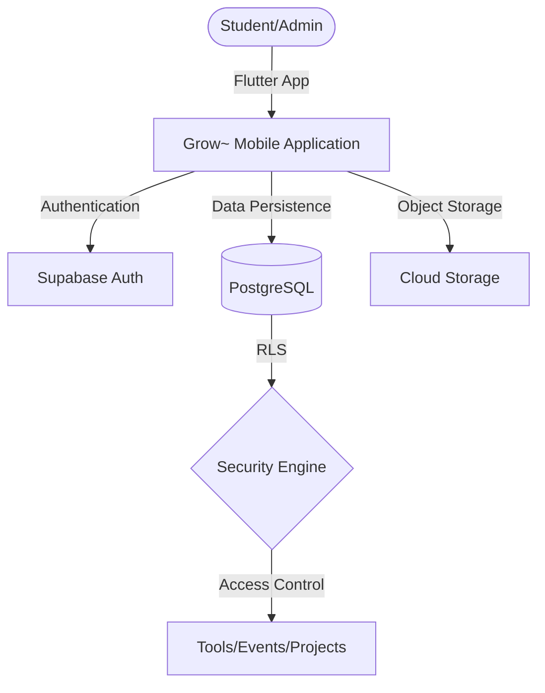
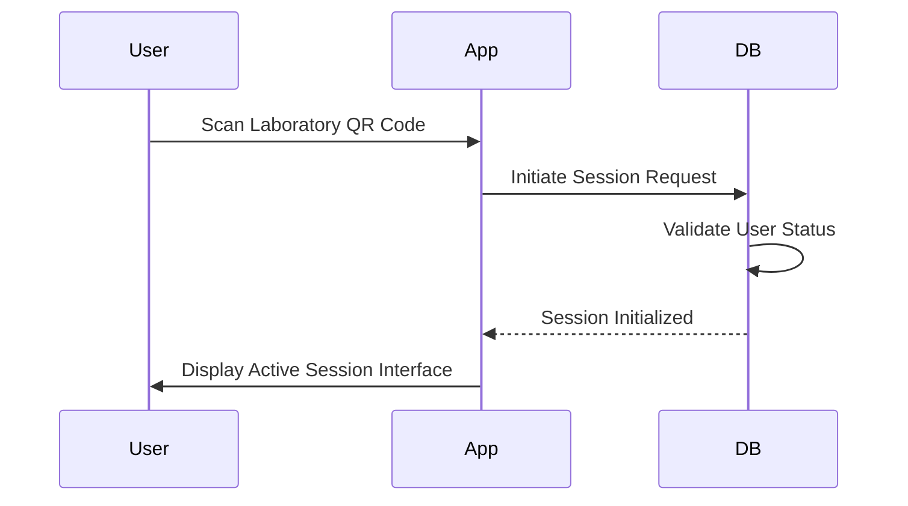

# Grow~ by IdeaLab
[](https://github.com/NAVANEETHVVINOD/Grow-by-IL/actions/workflows/ci.yml)

Grow~ is a production-grade Innovation Lab Management System designed for educational institutions. It provides a structured environment for lab access control, tool reservation, project collaboration, and inventory management through a secure, role-based governance model.

---

## System Architecture

### Frontend
Developed using the Flutter framework, utilizing a feature-first architecture and Riverpod for reactive state management. The application is optimized for Android deployment.

### Backend
Powered by Supabase (PostgreSQL), leveraging GoTrue for authentication, Row Level Security (RLS) for data governance, and S3-compatible storage for asset management.

### Infrastructure Overview


---

## Governance and Operations

The platform implements a strict Role-Based Access Control (RBAC) model enforced at the database level.

| Role | Responsibility |
| :--- | :--- |
| **student** | Standard user access to lab resources and project collaboration. |
| **lab_admin** | Operational management of tools, maintenance logs, and inventory. |
| **event_manager** | Logistics and scheduling for lab workshops and events. |
| **super_admin** | Global system governance, role assignment, and moderation. |

### Security Implementation
- **Database Layer**: Row Level Security (RLS) ensures data isolation.
- **Application Layer**: Route guards and dynamic UI components based on authenticated roles.
- **Auditability**: Automated logging of administrative actions for system transparency.

---

## Operational Flows

### Laboratory Access Control


### Resource Management Lifecycle
1. **Request**: Users submit reservations for specific lab tools.
2. **Validation**: The system performs real-time overlap and availability checks.
3. **Fulfillment**: Administrators verify tool status and facilitate the booking.
4. **Conclusion**: Usage metrics are recorded for operational auditing.

---

## Technical Specifications

- **Framework**: Flutter 3.41.9 (Stable)
- **Primary Language**: Dart
- **Database**: PostgreSQL (Supabase)
- **CI/CD**: GitHub Actions (Linting, Testing, Automated Release)

---

## Development and Deployment

### Installation
```bash
git clone https://github.com/NAVANEETHVVINOD/Grow-by-IL.git
cd grow
flutter pub get
flutter run
```

### CI/CD Workflow
The project utilizes a multi-stage CI/CD pipeline for quality assurance:
1. **Quality Gate**: Static analysis, formatting verification, and dependency integrity.
2. **Build Verification**: Automated release-mode compilation checks.
3. **Release Automation**: Tagged versions automatically generate installable APK artifacts.

---

## Contribution Guidelines
Please refer to the [CONTRIBUTING.md](CONTRIBUTING.md) file for details on the branching strategy and pull request process.

---
*Developed by IdeaLab. Professional Innovation Lab Management.*
