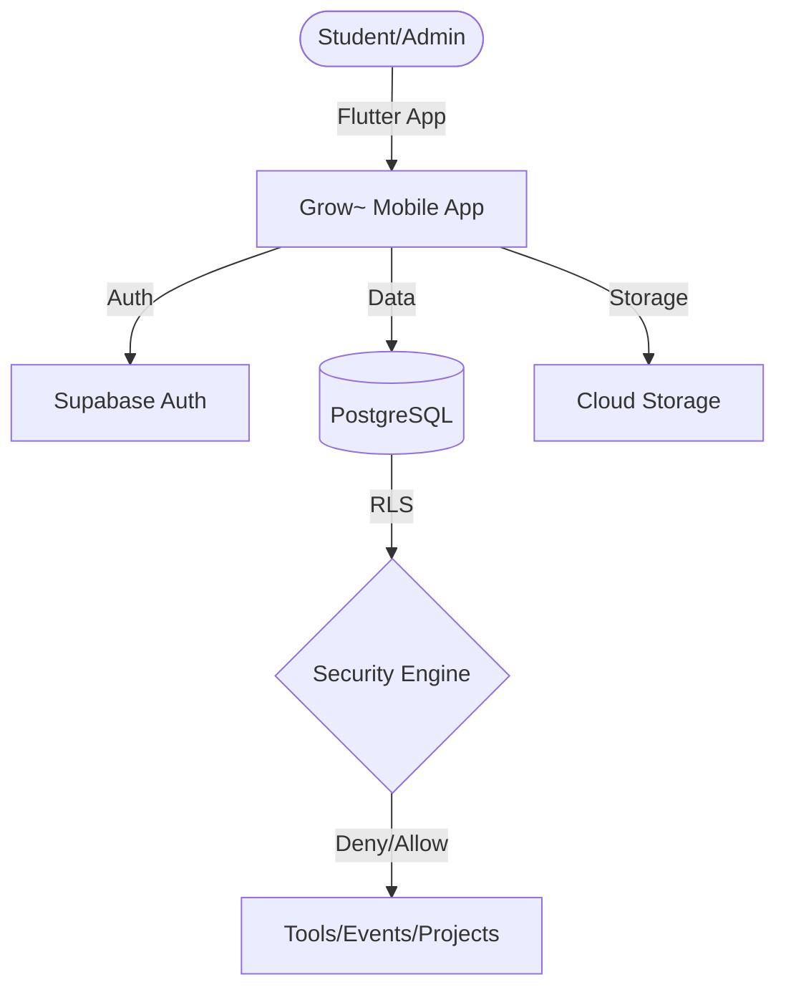
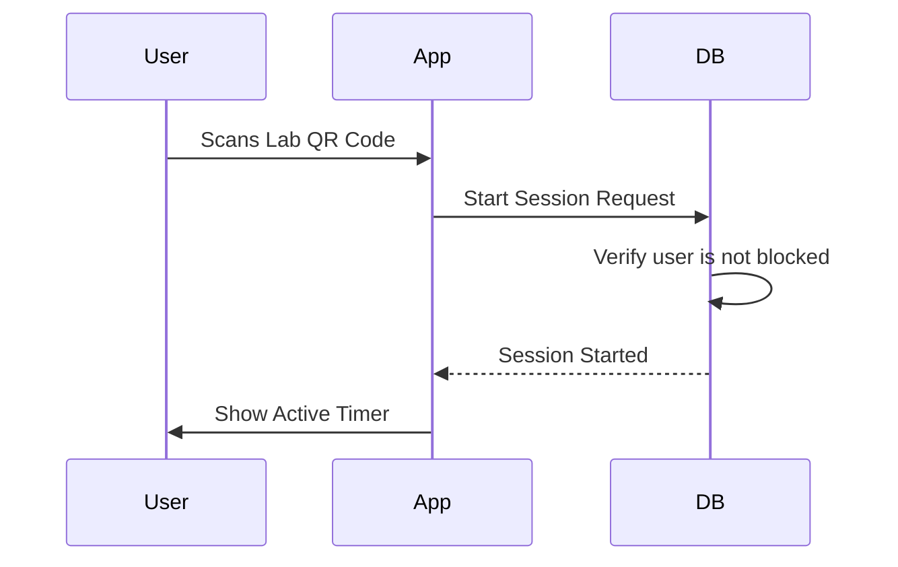

# Grow~ by IdeaLab 🚀
[](https://github.com/NAVANEETHVVINOD/Grow-by-IL/actions/workflows/ci.yml)
[](docs/rc1-release.md)

**Grow~** is a production-grade Innovation Lab Management System designed for colleges. It streamlines lab access, tool booking, project collaboration, and inventory tracking with a secure, role-based architecture.

---

## 🏗️ System Architecture

### Frontend (Mobile-First)
Built with **Flutter**, following a feature-first clean architecture with **Riverpod** for reactive state management.

### Backend (Serverless)
Powered by **Supabase**, utilizing PostgreSQL for data, GoTrue for Auth, and S3-compatible Storage for media.

### Infrastructure


---

## 🔐 Governance & Operations (RC2)

The system is governed by a strict **Role-Based Access Control (RBAC)** model enforced at the database level via Row Level Security (RLS).

| Role | Responsibility |
| :--- | :--- |
| **student** | Default access to lab resources. |
| **lab_admin** | Manages tools and inventory. |
| **event_manager** | Manages workshop schedules. |
| **super_admin** | Global governance and role assignment. |

### Security Model
- **Frontend**: Protected routes and UI degradation.
- **Backend**: Every query is filtered by the user's role stored in `public.users`.

---

## 🔄 User & Control Flows

### Lab Check-in Flow


### Tool Booking Lifecycle
1. **Request**: Student selects tool and time slot.
2. **Validation**: System checks for overlaps in real-time.
3. **Fulfillment**: `lab_admin` verifies tool health.
4. **Completion**: System logs usage for audit.

---

## 🛠️ Technical Stack

- **Framework**: Flutter 3.41.9
- **State Management**: Riverpod 2.6
- **Database**: PostgreSQL (Supabase)
- **CI/CD**: GitHub Actions
- **Design**: Neo-Brutalism Design System

---

## 🚀 Getting Started

### Prerequisites
- Flutter SDK `^3.6.0`
- Supabase Project

### Environment Setup
Create a `.env` file or use `--dart-define`:
```bash
--dart-define=SUPABASE_URL=YOUR_URL
--dart-define=SUPABASE_ANON_KEY=YOUR_KEY
```

### Installation
```bash
git clone https://github.com/NAVANEETHVVINOD/Grow-by-IL.git
cd grow
flutter pub get
flutter run
```

---

## 🤝 Contributing
Please see [CONTRIBUTING.md](CONTRIBUTING.md) for our professional branching and PR workflow.

---
*Developed by IdeaLab. Empowering the next generation of makers.*
